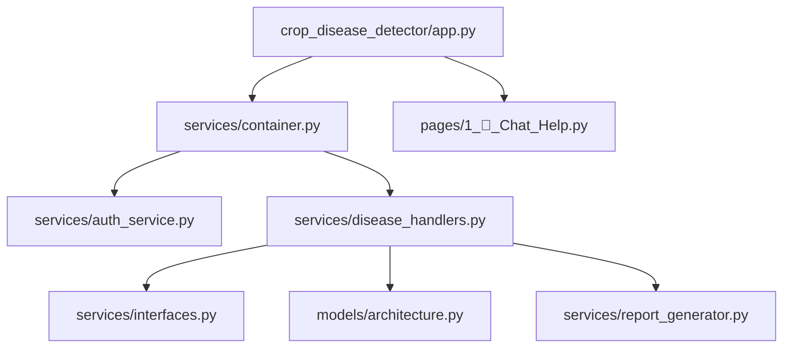

# 🌾 Rice & Pulse Disease Detection System - Technical Documentation

## 📋 Executive Summary
This project is an advanced AI-powered agricultural diagnostic tool designed to detect crop diseases (specifically Rice) from leaf images. It uses Deep Learning (CNNs) for analysis and provides a professional, secure web interface for farmers.

The system now goes beyond detection by offering **Actionable Cure Plans** and **Downloadable PDF Reports**, ensuring farmers have tangible next steps.

The project has been engineered with **Enterprise Software Standards** in mind, adhering strictly to **SOLID Principles** and utilizing modern design patterns like **Dependency Injection** and **Factory Pattern**.

---

## 🏗️ System Architecture

The application is built using a **Layered Architecture** to ensure separation of concerns:

1.  **Presentation Layer (`app.py`)**: Handles UI, user interaction, and displays results. It is "dumb" and only displays what the services provide.
2.  **Service Layer (`services/`)**: Contains the core business logic.
    *   **Auth Service**: Manages user login/logout security.
    *   **Disease Handlers**: Orchestrates the AI model loading and prediction logic.
    *   **Reporting Service**: Generates professional PDF reports.
3.  **Data/Model Layer**:
    *   **Models**: Contains the raw neural network architecture (`models/`).
    *   **Data**: Stores static disease information and cure steps (`services/disease_data.py`).
4.  **Infrastructure (`services/container.py`)**: A "Dependency Container" that wires everything together.

---
    
## 🚀 Key Features

*   **Dual-Crop Disease Detection**: Supports both Rice and Pulse crops with dedicated AI models.
*   **AI-Powered Assistant**: Integrated Botpress chatbot in the sidebar for instant help.
*   **Comprehensive Reporting**:
    *   **PDF Generation**: Download professional reports with diagnosis and images.
    *   **Cure Response Mechanism**: Get step-by-step healing plans for detected diseases.
*   **Dynamic UI**:
    *   **Adjustable Sidebar**: User-controllable width (300px-1200px) and chatbot height.
    *   **Context-Aware**: Chatbot is available alongside analysis results.
*   **Secure Authentication**: Role-based login system.
*   **Enterprise Architecture**: Built on SOLID principles for maintainability.

---

## 📂 Project Structure Explained

Here is the breakdown of every important file and folder in the system:



### 1. Root Directory
*   `run.py`: Convenience script to run the application.
    *   **Usage**: `python run.py` - Simplifies running the app.
*   `setup.py`: Package configuration for installation.
    *   **Purpose**: Allows `pip install -e .` for development installation.
*   `SOLID_PRINCIPLES.md`: Documentation of the 5 architectural principles applied.
*   `requirements.txt`: List of all Python libraries needed.

### 2. Main Package (`crop_disease_detector/`)
This is the core application package following Python best practices.

*   **`app.py`**: The entry point.
    *   **Features**: Dynamic sidebar with adjustable width and an integrated **AI Chatbot** (Botpress).
    *   **New**: PDF report download button integrated into results display.
    *   *Role*: Presentation Layer. Asks specific services for logic and displays results.
    
*   **`pages/`**: Streamlit multi-page app pages.
    *   `1_🤖_Chat_Help.py`: Full-screen chatbot interface for user assistance.
    *   *Note*: This location is correct for Streamlit's automatic page discovery.

### 3. Services Directory (`crop_disease_detector/services/`)
This is the engine room of the application.

*   **`interfaces.py`**: Defines the "Contracts" (Interfaces).
    *   `IDiseasePredictor`: "Anyone who wants to be a predictor MUST have a `predict()` method."
    *   `IAuthService`: "Anyone who handles auth MUST have a `login()` method."
    *   `PredictionResult`: Standardized result object for LSP compliance.
    
*   **`auth_service.py`**: Handles security.
    *   `StreamlitAuthService`: The actual code that draws the login box and checks passwords.
    
*   **`disease_handlers.py`**: Business logic for crops.
    *   `RiceDiseaseHandler`: Knows how to load the Rice model and interpret results.
    *   `PulseDiseaseHandler`: Handles pulse crop disease detection.
    *   **Updated**: Model paths now reference `crop_disease_detector/models/`.
    
*   **`report_generator.py`**: Handles PDF generation.
    *   `ReportGenerator`: Creates downloadable PDF reports using ReportLab.
    *   **Features**: Professional formatting, disease info, images, treatment guidance.
    
*   **`disease_data.py`**: Static Data Storage.
    *   Contains dictionaries of disease info and **cure steps**, isolating data from logic.
    *   Includes `RICE_DISEASE_INFO` and `PULSE_DISEASE_INFO`.
    
*   **`container.py`**: The **Dependency Injection Container**.
    *   This is a "Factory" that creates all objects efficiently.
    *   Creates the Auth Service and the correct Crop Handler.
    *   Ensures the App never creates them manually.

### 4. Models Directory (`crop_disease_detector/models/`)
*   `architecture.py`: The pure PyTorch code defining the Convolutional Neural Network (CNN).
*   `best_model.pth`: The actual trained "brain" of the AI for rice (weights file).
*   `pulse_disease_model.pth`: Trained model for pulse crops.

---

## 🛡️ SOLID Principles Implementation

We didn't just write code; we engineered it. Here is how we applied the 5 Golden Rules of Software Design:

### 1. Single Responsibility Principle (SRP)
*   **Before:** `app.py` did everything.
*   **Now:** `app.py` does UI. `auth_service.py` does Security. `disease_handlers.py` does AI. `architecture.py` defines the Model. Each file has **one job**.

### 2. Open/Closed Principle (OCP)
*   **Concept:** Open for extension, Closed for modification.
*   **Applied:** To add "Wheat" detection, we just create a `WheatDiseaseHandler` class. We **do not touch** the existing Rice logic or the App logic. The system is easy to grow without breaking.

### 3. Liskov Substitution Principle (LSP)
*   **Concept:** Subclasses must behave like their parents.
*   **Applied:** `RiceDiseaseHandler` and `PulseDiseaseHandler` both return a standardized `PredictionResult` object. The App treats them exactly the same. You can swap them out and nothing crashes.

### 4. Interface Segregation Principle (ISP)
*   **Concept:** Don't force clients to use methods they don't need.
*   **Applied:** We split functionality into `IDiseasePredictor` (for AI) and `IDiseaseInfoProvider` (for text info). If we make a simple "Info Page", it doesn't need to load the heavy AI model.

### 5. Dependency Inversion Principle (DIP)
*   **Concept:** Depend on abstractions, not concretions.
*   **Applied:** `app.py` does not import `RiceDiseaseHandler` directly. It asks the `DependencyContainer` for a handler. This means we can easily swap the AI engine in the future without rewriting the UI.

---

## 🧪 Testing

We included a robust test suite in the `tests/` folder:
*   `test_container.py`: Verifies that our "Factory" creates objects correctly.
*   `test_solid_compliance.py`: Ensures that our classes strictly follow the rules we set (like usage of Interfaces).

To run tests:
```bash
pytest
```
